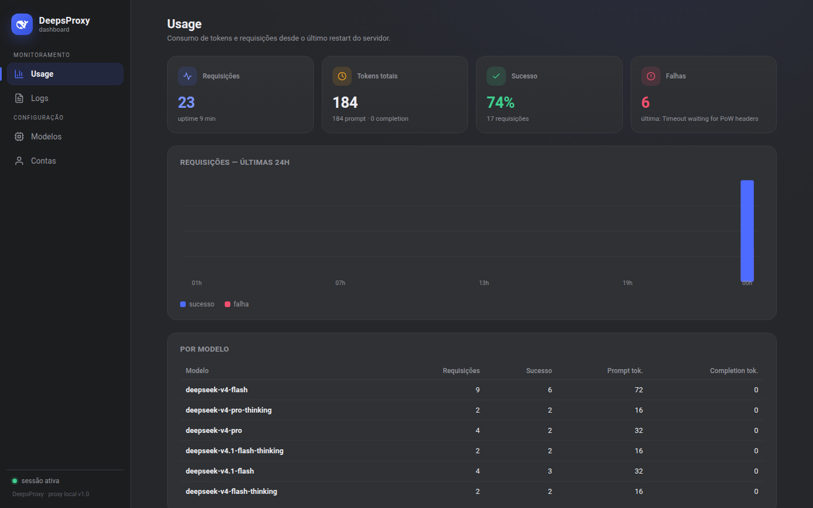
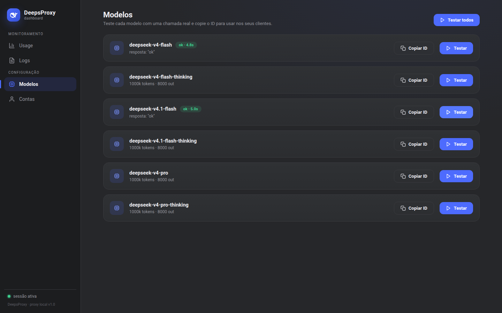
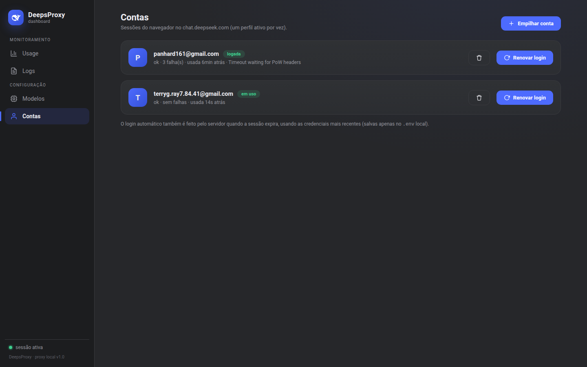
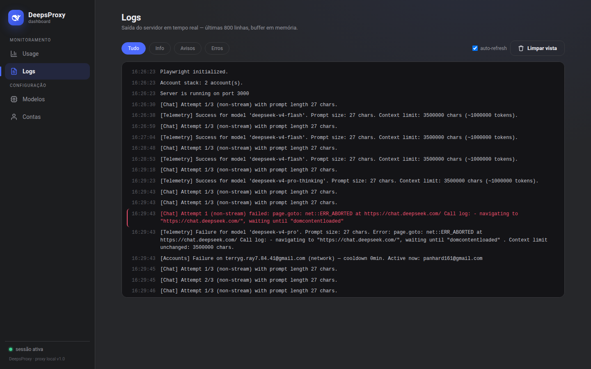
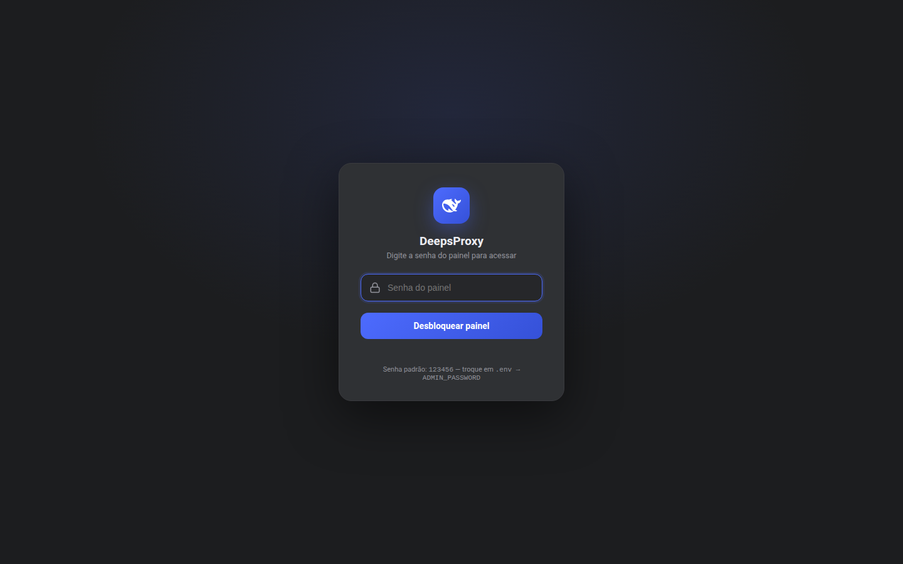
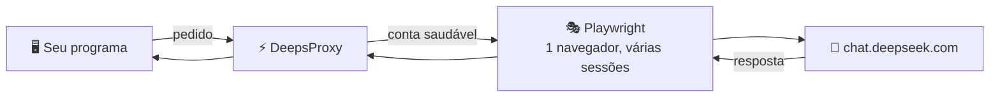

<div align="center">

# 🐋 DeepsProxy

**Use os modelos do DeepSeek no seu programa, como se fosse a API da OpenAI.**

[](https://github.com/Panhard-Dev/deepsproxy/actions/workflows/ci.yml)
[](LICENSE)

**Instala → adiciona sua conta → usa.** Com painel de controle, várias contas e login automático.

</div>

---

## 🖼️ Como fica o painel



---

## 🚀 Como usar — 3 passos

### 1️⃣ Instalar

```bash
git clone https://github.com/Panhard-Dev/deepsproxy.git
cd deepsproxy
npm install
npx playwright install chromium
cp .env.example .env
npm start
```

### 2️⃣ Adicionar sua conta

1. Abra **http://localhost:3000/admin** no navegador
2. Digite a senha do painel — **padrão: `123456`**
3. Vá em **Contas → "Empilhar conta"** → coloque email e senha do DeepSeek
4. Pronto: o proxy loga sozinho e a conta entra na rotação

> Pode adicionar quantas contas quiser. Se uma der problema, o proxy troca pra outra automaticamente.

### 3️⃣ Usar no seu programa

Só aponte o cliente para o proxy:

```ts
import OpenAI from 'openai';

const client = new OpenAI({
  baseURL: 'http://localhost:3000/v1',      // endereço do proxy
  apiKey: 'a-chave-do-env',                  // a API_KEY do seu .env
});

const res = await client.chat.completions.create({
  model: 'deepseek-v4-flash',
  messages: [{ role: 'user', content: 'Olá!' }],
});
```

Funciona com qualquer ferramenta que aceite API da OpenAI (Cursor, Continue, LZ, scripts...).

---

## 🖥️ O que tem no painel (`/admin`)

| Aba | Pra que serve |
|-----|---------------|
| **📊 Usage** | Quantas requisições e tokens você gastou |
| **📜 Logs** | Tudo que o servidor está fazendo, ao vivo |
| **🧩 Modelos** | Testar cada modelo com 1 clique e copiar o ID |
| **👤 Contas** | Adicionar, remover e acompanhar suas contas |

<details>
<summary><b>Ver mais telas do painel</b></summary>

| | |
|---|---|
|  |  |
|  |  |

</details>

---

## ❓ Perguntas rápidas

<details>
<summary><b>Quais modelos posso usar?</b></summary>

| ID no pedido | O que é |
|--------------|---------|
| `deepseek-v4-flash` | Flash, modo normal |
| `deepseek-v4-flash-thinking` | Flash, com raciocínio |
| `deepseek-v4.1-flash` | Apelido do Flash normal |
| `deepseek-v4.1-flash-thinking` | Apelido do Flash com raciocínio |
| `deepseek-v4-pro` | Pro, modo normal |
| `deepseek-v4-pro-thinking` | Pro, com raciocínio |
</details>

<details>
<summary><b>Como troco a senha do painel?</b></summary>

No arquivo `.env`, mude a linha `ADMIN_PASSWORD=123456` para a senha que quiser e reinicie com `bash restart-server.sh`.
</details>

<details>
<summary><b>Como funciona a troca automática de contas?</b></summary>

O proxy fica usando sempre a mesma conta enquanto ela estiver boa.

- A sessão expirou? → ele **loga sozinho** de novo
- A conta der problema? → ela fica de **castigo** por um tempo (5 a 15 min) e o proxy **passa a usar a próxima conta**
- Todas de castigo? → você recebe um erro claro dizendo em quantos minutos volta

Adicione contas no painel, aba **Contas**.
</details>

<details>
<summary><b>Funciona com ferramentas (tool calling)?</b></summary>

Sim — formato OpenAI padrão. Seu agente declara as ferramentas, o proxy entrega as chamadas no formato certo, e tolera até quando o modelo responde "torto" (JSON quebrado, tags faltando, formato interno dele vazando...).
</details>

<details>
<summary><b>Quais são todas as configurações do .env?</b></summary>

| Variável | Pra que serve | Padrão |
|----------|---------------|--------|
| `PORT` | Porta do servidor | `3000` |
| `API_KEY` | Senha que os **clientes** usam pra falar com o proxy | *(sem)* |
| `ADMIN_PASSWORD` | Senha do **painel** | `123456` |
| `DEEPSEEK_EMAIL` / `DEEPSEEK_PASSWORD` | Conta inicial (vai pro stack no primeiro boot) | — |
| `PLAYWRIGHT_HEADLESS` | Navegador invisível | `true` |
| `PLAYWRIGHT_TIMEOUT` | Timeout do Playwright (ms) | `30000` |
| `CONTEXT_TOKENS` | Limite de contexto em tokens | `1000000` |
| `DEEPSEEK_AUTOLOGIN_WAIT_MS` | Espera do login automático (ms) | `90000` |
| `TOOLCALL_DEBUG` | `1` = logs detalhados do parser | *(off)* |
</details>

<details>
<summary><b>Deu problema. E agora?</b></summary>

| Problema | Solução |
|----------|---------|
| "Failed to create a ProcessSingleton" | O perfil tá em uso: `bash restart-server.sh`, apague `deepseek_profile/Singleton*` |
| Porta 3000 ocupada | `bash restart-server.sh` resolve (mata o processo antigo) |
| Erro `429 no_account_available` | Todas as contas de castigo — espere os minutos que a mensagem diz, ou adicione outra conta |
| Resposta veio vazia / estranha | Abra o painel → Logs e veja a linha do erro |
| `context_length_exceeded` | A conversa é grande demais: aumente `CONTEXT_TOKENS` no `.env` |
</details>

<details>
<summary><b>Comandos disponíveis</b></summary>

| Comando | O que faz |
|---------|-----------|
| `npm start` | Liga o servidor |
| `npm run dev` | Liga com recarga automática (pra desenvolver) |
| `npm run login` | Abre navegador pra logar na mão (raramente necessário) |
| `npm test` | Roda os 95 testes |
| `npm run build` | Compila o TypeScript |
| `bash restart-server.sh` | Reinicia tudo limpo |
| `bash clean-and-login.sh` | Limpa travas e abre o login |
</details>

## 🏗️ Como funciona por dentro



## 📄 Licença

MIT — veja [LICENSE](LICENSE).

## ⚠️ Aviso

> Projeto **educacional e de pesquisa**. Automatizar serviços de terceiros pode violar os termos de uso deles — use por sua conta e risco.
