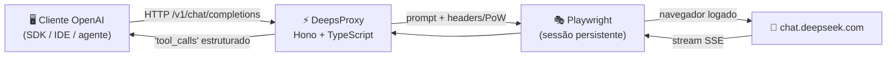

<div align="center">

# 🚀 DeepsProxy

**Proxy local compatível com OpenAI para os modelos do DeepSeek — com tool calling à prova de bala.**

[](https://github.com/Panhard-Dev/deepsproxy/actions/workflows/ci.yml)
[](LICENSE)
[](https://www.typescriptlang.org/)
[](https://nodejs.org/)
[](https://hono.dev/)
[](https://playwright.dev/)

*Exponha os modelos do `chat.deepseek.com` como uma API OpenAI local — qualquer SDK, qualquer cliente, tool calling incluído.*

</div>

---



## ✨ Destaques

- 🤖 **100% compatível com OpenAI** — `/v1/chat/completions`, `/v1/models`, `/health`, streaming SSE e API key opcional
- 🔨 **Tool calling robusto** — sobrevive a streams fragmentados, JSON malformado, tags faltando, nomes fuzzy (`getWeather` → `get_weather`) e chamadas sem tags
- 🧬 **Normalizador DSML** — converte o formato interno que o modelo às vezes vaza (`<｜｜DSML｜｜ invoke ...>`) em `tool_calls` estruturado, em tempo real
- 📏 **Contexto gigante configurável** — `CONTEXT_TOKENS` (default 1M); a janela é **configuração, não adivinhação**: erro de rede nunca encolhe seu contexto
- ✂️ **Truncamento inteligente** — preserva pares atômicos `assistant(tool_calls) + tool`, mantém as mensagens recentes e avisa quando corta
- 🧾 **Rejeição limpa** — input gigante demais volta como `400 context_length_exceeded` no formato OpenAI, sem queimar navegador
- 💾 **Sessão persistente** — login uma vez no navegador, sessão salva para sempre em `deepseek_profile/`
- ✅ **95 testes** rodando no CI

## 🚀 Começando

```bash
# 1. Clonar e instalar
git clone https://github.com/Panhard-Dev/deepsproxy.git
cd deepsproxy
npm install
npx playwright install chromium

# 2. Login no DeepSeek (abre navegador visível — feche a janela quando logar)
npm run login

# 3. Subir o servidor
npm start
```

> Servidor travando o perfil? `bash clean-and-login.sh` limpa processos/locks e reabre o login.

## ⚙️ Configuração

Crie um `.env` na raiz (ou copie o [`.env.example`](.env.example)):

| Variável | Descrição | Default |
|----------|-----------|---------|
| `PORT` | Porta HTTP do servidor | `3000` |
| `API_KEY` | Exige `Authorization: Bearer` ou `X-API-Key` | *(sem auth)* |
| `PLAYWRIGHT_HEADLESS` | Navegador headless | `true` |
| `PLAYWRIGHT_TIMEOUT` | Timeout do Playwright (ms) | `30000` |
| `CONTEXT_TOKENS` | Janela de contexto em tokens | `1000000` |
| `DEEPSEEK_TOOL_OPEN` / `DEEPSEEK_TOOL_CLOSE` | Tags canônicas de tool call | `<tool_call>` / `</tool_call>` |
| `TOOLCALL_DEBUG` | `1` = logs de debug do parser | *(off)* |

## 📡 API

<details open>
<summary><b>GET /v1/models</b></summary>

| ID | Modelo real | Modo |
|----|-------------|------|
| `deepseek-v4-flash` | Flash | normal |
| `deepseek-v4-flash-thinking` | Flash | raciocínio |
| `deepseek-v4.1-flash` | Flash | normal *(alias)* |
| `deepseek-v4.1-flash-thinking` | Flash | raciocínio *(alias)* |
| `deepseek-v4-pro` | Pro/Expert | normal |
| `deepseek-v4-pro-thinking` | Pro/Expert | raciocínio |

O roteamento é pelo nome: `thinking` → ativa raciocínio; `pro` → modelo Expert.
</details>

<details open>
<summary><b>POST /v1/chat/completions</b></summary>

```bash
curl http://localhost:3000/v1/chat/completions \
  -H "Content-Type: application/json" \
  -d '{
    "model": "deepseek-v4-flash",
    "messages": [{"role": "user", "content": "Olá!"}],
    "stream": true
  }'
```

Em SDKs OpenAI, basta apontar o `baseURL`:

```ts
import OpenAI from 'openai';

const client = new OpenAI({
  baseURL: 'http://localhost:3000/v1',
  apiKey: 'sua-api-key',
});

const res = await client.chat.completions.create({
  model: 'deepseek-v4-flash',
  messages: [{ role: 'user', content: 'Explique TypeScript' }],
});
```

</details>

<details>
<summary><b>Tool calling (exemplo completo)</b></summary>

```jsonc
// 1. Declare as tools (formato OpenAI padrão)
{
  "model": "deepseek-v4-flash",
  "messages": [{ "role": "user", "content": "Tempo em São Paulo?" }],
  "tools": [{
    "type": "function",
    "function": {
      "name": "get_weather",
      "description": "Obter previsão do tempo",
      "parameters": {
        "type": "object",
        "properties": { "location": { "type": "string" } },
        "required": ["location"]
      }
    }
  }]
}

// 2. O modelo responde
// finish_reason: "tool_calls"
// { "tool_calls": [{ "id": "call_x", "function": { "name": "get_weather",
//    "arguments": "{\"location\":\"São Paulo\"}" } }] }

// 3. Execute e devolva: role "tool" + tool_call_id correspondente
```

> **Nota:** as ferramentas são executadas pelo **cliente** (seu agente) — o proxy só traduz o protocolo.

</details>

## 🔧 O que o parser tolera

| Situação do modelo | Comportamento |
|--------------------|---------------|
| Stream fragmentado (até 1 char por chunk) | ✅ reconstrói a chamada |
| `</tool_call>` dentro de strings de argumentos | ✅ não trunca |
| JSON malformado (aspas/chaves faltando) | ✅ repara |
| JSON duplamente escapado (`\"name\"`) | ✅ desescapa |
| Nome fuzzy (`readFile` → `read_file`) | ✅ fuzzy-match |
| Chamada sem tags (JSON cru no texto) | ✅ extrai |
| Vazamento do formato interno DSML | ✅ converte ao vivo |
| Múltiplas chamadas por turno | ✅ |

## 🧪 Testes

```bash
npm test   # 95 testes do parser, recuperação de JSON e fluxos de tools
```

## 🛠️ Scripts

| Comando | Descrição |
|---------|-----------|
| `npm start` | Servidor em produção (headless) |
| `npm run dev` | Desenvolvimento com hot-reload |
| `npm run login` | Login visível + persistência de sessão |
| `npm test` | Suite de testes |
| `npm run build` | Compila para `dist/` |
| `bash restart-server.sh` | Reinício limpo do servidor |
| `bash clean-and-login.sh` | Limpa locks e reabre o login |

## 🔍 Troubleshooting

<details>
<summary><b>Failed to create a ProcessSingleton</b></summary>

O perfil do navegador está em uso por outro processo. `bash restart-server.sh` (ou `fuser -k 3000/tcp`), remova `deepseek_profile/Singleton*` e tente o login de novo.
</details>

<details>
<summary><b>Porta 3000 ocupada por código antigo</b></summary>

O processo filho do tsx sobrevive ao `pkill`. Use `fuser -k 3000/tcp` — ou o `restart-server.sh`, que já faz tudo.
</details>

<details>
<summary><b>Agente "perde o contexto" no meio da tarefa</b></summary>

Procure linhas `[Compression]` no log do servidor: elas mostram exatamente o que foi mantido/descartado. Com `CONTEXT_TOKENS` alto, a compressão só entra acima do limite configurado.
</details>

<details>
<summary><b>400 context_length_exceeded</b></summary>

O prompt excede `CONTEXT_TOKENS` mesmo após truncamento. Aumente o valor no `.env` ou resuma a conversa.
</details>

## 📄 Licença

Distribuído sob a licença MIT — veja [LICENSE](LICENSE).

## ⚠️ Disclaimer

> Este projeto é fornecido estritamente para **fins educacionais e de pesquisa**.

Automatização de serviços de terceiros pode violar os termos de uso da plataforma. O usuário é integralmente responsável pelo uso deste software, incluindo conformidade com leis, regulamentos e contratos de serviço aplicáveis. **Use por sua conta e risco.**
